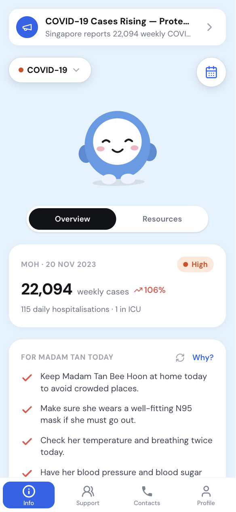
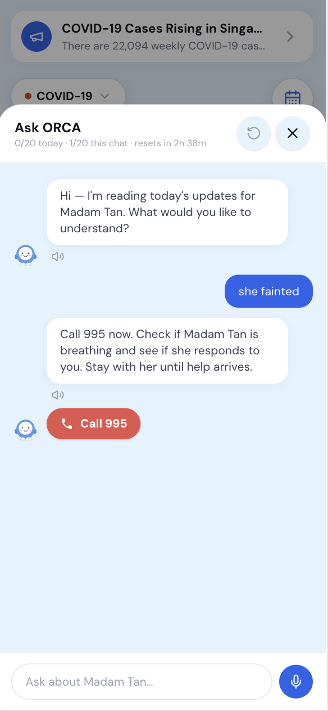
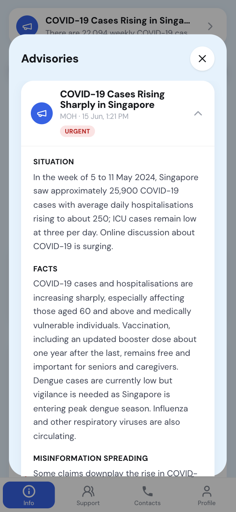
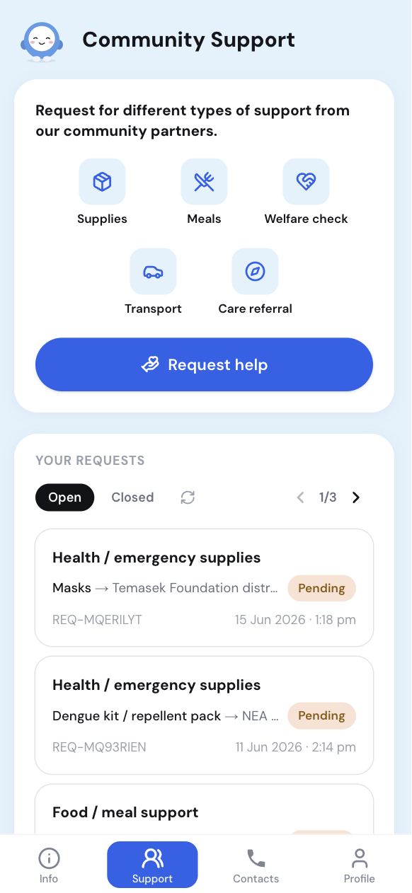
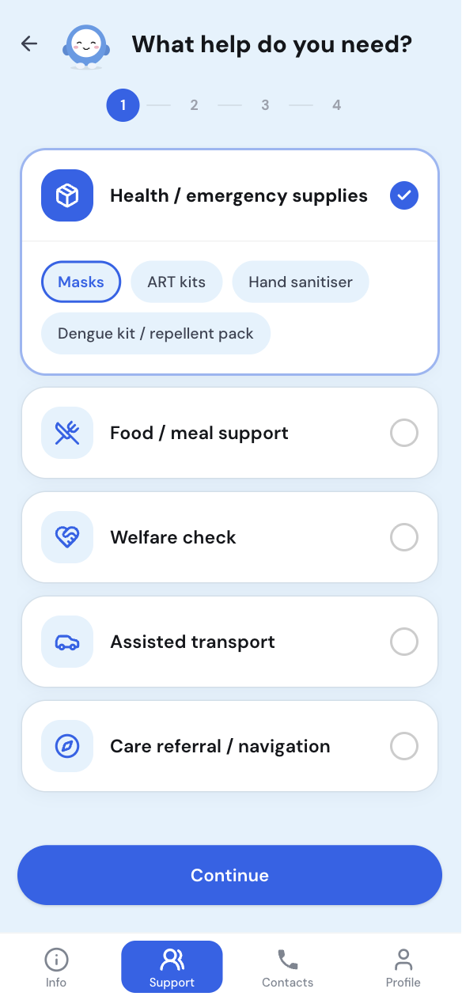
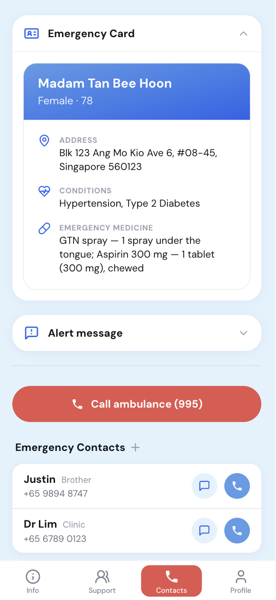
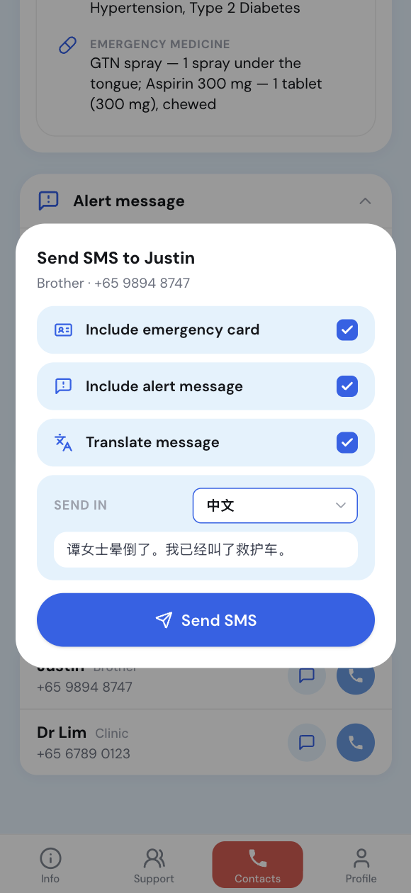
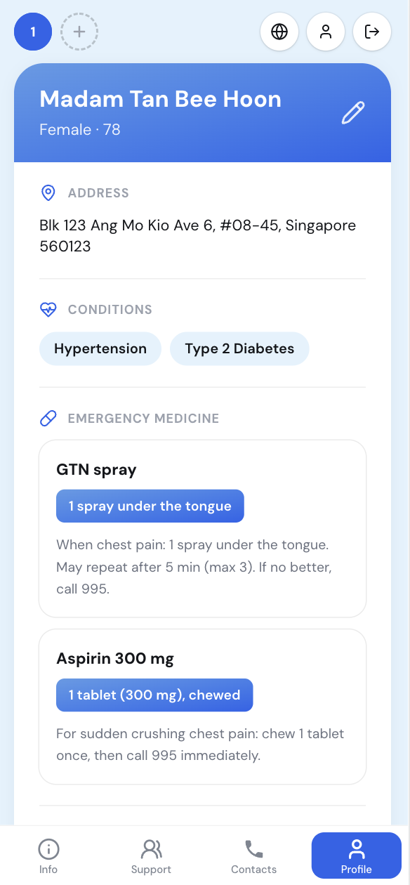

<p align="center">
  
</p>

# ORCA Caregiver Web App

> Turns public-health advisories into clear, personalised action for the people you care for.

**ORCA** stands for **Outreach, Resource & Caregiver Assistance**.

---

## The problem

When a health threat like **COVID-19** or **dengue** hits Singapore, caregivers of elderly and
vulnerable people are flooded with generic alerts — and left to work out, on their own, what any of
it means for *one specific person*. The guidance is one-size-fits-all, often only in English, and
useless the moment the connection drops. Asking for help — medication, groceries, a welfare check —
means knowing who to call and hoping someone picks up.

## How ORCA's Caregiver Web App solves it

ORCA is the caregiver's companion. It takes the official advisory and turns it into **plain,
personalised advice** for the person being cared for — accounting for their conditions, in the
caregiver's language, and working even offline.

- **Personalised by profile** — advisories and daily suggestions are matched to the care recipient's
  conditions, medicines, and care context.
- **Multilingual by design** — English, Chinese, Malay, Tamil, Bahasa Indonesia, Tagalog, and Burmese
  support helps caregivers act in the language they are comfortable with.
- **Emergency-aware** — guidance adapts by emergency type, such as respiratory illnesses, foodborne
  diseases, dengue outbreaks, and medical advisories.
- **Offline-first PWA** — key care details, emergency actions, saved guidance, and queued support
  requests keep working when the connection drops.
- **Connected to the response chain** — authority advisories flow into the app, and caregiver support
  requests flow out to community partners with status updates coming back.

## Features

### Info

| Info page | Ask ORCA | Advisories |
|---|---|---|
|  |  |  |

- **Info page**: Local situation overview, approved resources, and practical actions tailored to the care recipient's profile.
- **Ask ORCA**: Context-aware caregiver chat that uses the same emergency and care profile, with guardrails around diagnosis and medical advice.
- **Advisories**: Vetted authority broadcasts and verified resources shown in the caregiver's language.

### Support

| Support | Request form |
|---|---|
|  |  |

- **Support**: Choose the type of non-emergency help needed and see request history as partner updates flow back.
- **Request form**: Guided form turns the caregiver's need into a structured request that can be routed by fit, availability, and proximity.

### Contacts

| Contacts | SMS alerts |
|---|---|
|  |  |

- **Contacts**: Call 995 or an emergency contact with the care recipient's key details ready to read out.
- **SMS alerts**: Send an alert message with the emergency card, translated per contact when needed.

### Profile



- **Profile**: Care recipient details, conditions, medicines, and measurements that ORCA uses to personalise guidance.

## How it all connects

ORCA has three surfaces that stay in sync in **real time**:

```
 ┌──────────────────────┐   publishes    ┌──────────────────────┐   sends help    ┌──────────────────────┐
 │ ORCA Authority       │   advisory ─►   │ ORCA Caregiver       │   request ─►    │ ORCA Community       │
 │ Dashboard            │                 │ Web App      ◄ HERE  │                 │ Partner Dashboard    │
 │ · health officers    │                 │ · caregivers         │                 │ · partner orgs       │
 └──────────────────────┘                 └──────────────────────┘                 └──────────┬───────────┘
                                                    ▲                                         │
                                                    └───────── fulfilment status ◄────────────┘
```

From the caregiver's seat:

1. A health officer publishes a vetted advisory in the **Authority Dashboard** — it appears in ORCA
   instantly.
2. ORCA **tailors** that advisory to the care recipient's conditions and shows it in the caregiver's
   language.
3. The caregiver submits a **help request** (supplies, food, welfare check, transport, referral).
4. The request is routed to the right **Community Partner** organisation.
5. As the partner accepts, schedules, and fulfils it, the **status flows back** into ORCA — the
   caregiver always sees where things stand.

## Tech stack

- **Next.js 15** (App Router) · **React 19** · **TypeScript**
- **Tailwind CSS v4** · **framer-motion** (animations + the risk-reactive mascot)
- **Leaflet** + **Mapbox** for the dengue cluster map
- **Installable PWA** with a service worker, offline cache, and background-sync outbox
- **OpenAI** for chat, suggestions, voice, translation, and condition tailoring

## APIs & data sources

| Service | Used for | Details |
|---|---|---|
| OpenAI · Chat Completions | "Ask ORCA" assistant | `gpt-4o-mini` |
| OpenAI · Chat Completions | "For {name} today" suggestions (all 7 languages) | `gpt-4.1-mini` |
| OpenAI · Chat Completions | Translate urgent alerts | `gpt-4o-mini` |
| OpenAI · Speech | Read advice aloud (text-to-speech) | `gpt-4o-mini-tts` |
| OpenAI · Transcription | Voice-to-text in 7 languages | `gpt-4o-transcribe` |
| OpenAI · Chat Completions | Classify free-text conditions → care targets | `gpt-4o-mini` |
| data.gov.sg | Live COVID-19 weekly stats + NEA dengue clusters | Open data · no key |
| OneMap | Postal code → address autofill | gov.sg · no key |
| Mapbox | Dengue cluster basemap (`light-v11`) | token · falls back to OpenStreetMap / offline SVG |

## Getting started

```bash
npm install
cp .env.example .env.local     # add NEXT_PUBLIC_MAPBOX_TOKEN and OPENAI_API_KEY
npm run dev                    # http://localhost:3000
```

The installable PWA and offline features work best in a production build:

```bash
npm run build && npm start
```

---

<p align="center">
  Built for a hackathon by <strong>acacia tembusu dining hall</strong> 🌳
</p>
